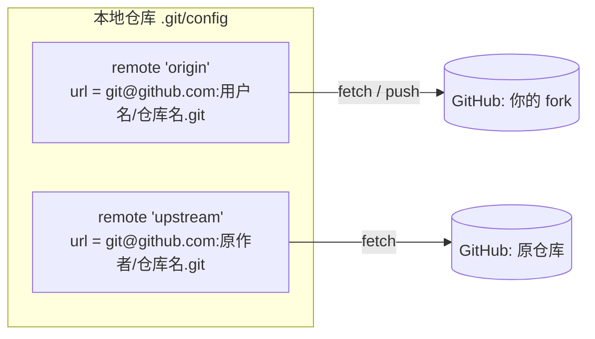
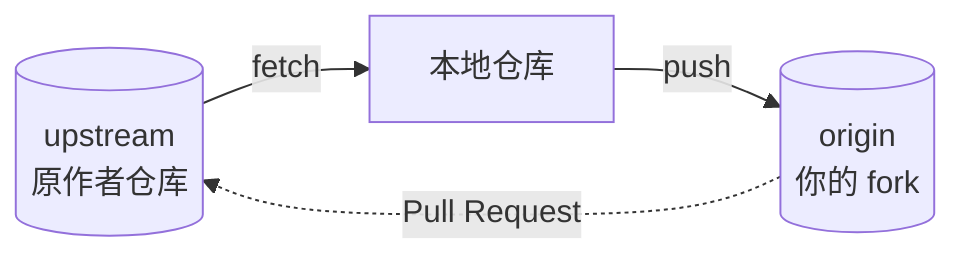
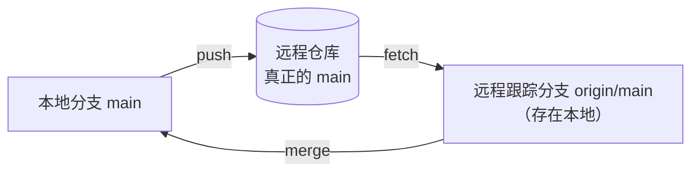

#工程化 #Git #remote #面试

# Git 远程仓库管理

## TL;DR

**remote 是本地给远程仓库地址起的一个别名，`origin` 只是 clone 时的默认命名，没有任何特殊性**。

- 查地址最常用 `git remote -v`——列出所有远程名及其 fetch / push 地址；
- 这些信息全部存在 `.git/config` 里，`git remote -v`、`git config --get remote.origin.url` 都是**纯本地读取，不联网**；只有 `git remote show origin` 会联网问远程；
- 改地址用 `git remote set-url origin <新地址>`，**换协议（SSH ↔ HTTPS）就是改这一行**；
- 一个仓库可以有多个 remote，`origin`（自己的）+ `upstream`（上游）是 fork 协作的标准配置；
- `origin/main` 不是远程分支，而是本地缓存的「**远程跟踪分支**」，只有 fetch/pull 才会更新它。

---

## 1. remote 到底是什么

remote 不是「远程仓库」本身，而是**本地仓库里的一条别名记录**：一个名字 → 一个 URL。



`git clone` 时 Git 自动把来源地址记成一个叫 `origin` 的 remote——**`origin` 只是约定俗成的默认名**，改成别的名字（甚至叫 `github`）功能上完全一样。

打开 `.git/config` 能看到它的真身：

```ini
[remote "origin"]
	url = git@github.com:用户名/仓库名.git
	fetch = +refs/heads/*:refs/remotes/origin/*
```

所以「查看远程地址」本质上就是**读这个配置文件**，不需要联网、不需要有网络权限。

---

## 2. 查看远程地址的几个命令

| 命令 | 输出 | 联网 | 适用场景 |
|---|---|---|---|
| `git remote` | 只有远程名（如 `origin`） | 否 | 快速确认有几个远程 |
| `git remote -v` | **远程名 + fetch/push 地址** | 否 | **日常首选** |
| `git remote get-url origin` | 只输出一个地址，纯净无修饰 | 否 | 写脚本、复制粘贴 |
| `git config --get remote.origin.url` | 同上，直接读配置项 | 否 | 老写法，脚本里常见 |
| `git remote show origin` | 地址 + 远程分支列表 + 跟踪关系 + 陈旧分支 | **是** | 排查跟踪关系、清理无效分支 |

`git remote -v` 的典型输出：

```bash
git remote -v
```

```
origin	git@github.com:用户名/仓库名.git (fetch)
origin	git@github.com:用户名/仓库名.git (push)
```

**两行不是重复**：Git 允许拉取和推送指向不同地址（见下一节），只是绝大多数情况两者相同，所以看起来像打印了两遍。`-v` 是 `--verbose`，不加 `-v` 就只有名字没有地址。

---

## 3. fetch 和 push 为什么是两行

Git 把「从哪里拉」和「往哪里推」当成两件独立的事，可以分别设置：

```bash
git remote set-url --push origin git@github.com:用户名/镜像仓库.git
```

设完之后 `git remote -v` 的两行就不一样了。这在这些场景有用：

- **拉取走只读镜像**（内网加速），推送走真正的主仓库；
- 拉取上游只读地址，推送到自己有写权限的 fork；
- 一份代码**同时推到多个平台**（`git remote set-url --add --push origin <另一个地址>`，之后一次 `git push` 推两处）。

查看某个方向的地址：

```bash
git remote get-url --push origin    # 推送地址
git remote get-url --all origin     # 全部地址（可能有多个推送地址）
```

---

## 4. 增删改：remote 的完整操作集

| 目的 | 命令 |
|---|---|
| 新增一个远程 | `git remote add upstream <地址>` |
| 修改地址（换协议、仓库改名/转移后） | `git remote set-url origin <新地址>` |
| 重命名 | `git remote rename origin old-origin` |
| 删除 | `git remote remove upstream` |
| 清理已在远程删除的跟踪分支 | `git remote prune origin`（等价 `git fetch --prune`） |

**最常见的一次修改是换协议**。同一个仓库的两种地址写法：

| 协议 | 地址格式 | 认证方式 |
|---|---|---|
| SSH | `git@github.com:用户名/仓库名.git` | 本机 SSH 密钥，配好后免密 |
| HTTPS | `https://github.com/用户名/仓库名.git` | 用户名 + Personal Access Token（走凭据管理器缓存） |

```bash
git remote set-url origin git@github.com:用户名/仓库名.git
```

换协议只影响「怎么连服务器」，不影响任何提交历史——地址是本地配置，改错了再改回来即可，没有破坏性。

---

## 5. 多个 remote：origin 与 upstream

fork 别人的仓库后，标准配置是两个远程：



```bash
git remote add upstream <原仓库地址>   # 一次性配置
git remote -v                          # 此时会看到 origin 和 upstream 各两行
git fetch upstream
git merge upstream/main                # 或 rebase，保持线性历史
git push origin main
```

「**upstream 只拉不推，origin 才是自己的写入口**」是这套配置的核心心智。完整的 fork 同步流程见 [[3.01 Git 核心操作与撤销]]。

---

## 6. `origin/main` 是什么：远程跟踪分支

初学最容易混淆的一点：`origin/main` **不是远程仓库上的分支**，而是本地的一份**快照缓存**，记录「我上次通信时，远程的 main 在哪个提交」。



由此推出几条日常结论：

- 只有 `git fetch` / `git pull` 会更新 `origin/main`——**不 fetch 的话它可能是几天前的旧信息**；
- `git pull` = `git fetch` + `git merge origin/main`，所以 pull 才会既更新缓存又合并；
- 远程上已删除的分支，本地的 `origin/xxx` 不会自动消失，要靠 `--prune` 清理。

**跟踪关系**（本地分支绑定到哪个远程分支）单独记在配置里：

```bash
git push -u origin main    # -u 即 --set-upstream，第一次推送时建立绑定
git branch -vv             # 查看每个本地分支跟踪的是谁
```

绑定之后才能直接 `git push` / `git pull` 而不写参数。remote 名（地址别名）和 upstream 分支（跟踪目标）是两层概念，别混为一谈——`git remote -v` 查前者，`git branch -vv` 查后者。

---

## 面试问答

### Q: 怎么查看当前仓库的远程地址？

满分答案：`git remote -v` 列出所有远程名及其 fetch/push 地址，是日常首选；只要名字用 `git remote`，脚本里取单个地址用 `git remote get-url origin`（或老写法 `git config --get remote.origin.url`）。这些都是读 `.git/config` 的本地操作、不联网；`git remote show origin` 会实际访问远程，额外给出远程分支列表和跟踪关系，适合排查问题。补一句原理：remote 只是「别名 → URL」的本地配置，`origin` 是 clone 时的默认命名，没有特殊地位。

### Q: `git remote -v` 为什么每个远程打印两行？

满分答案：Git 把拉取地址和推送地址分开存，两行分别标注 `(fetch)` 和 `(push)`。默认二者相同所以看着像重复，但可以用 `git remote set-url --push origin <地址>` 单独改推送地址——典型用途是拉取走只读镜像、推送走主仓库，或用 `--add --push` 配置一次推送同步到多个平台。

### Q: `origin/main` 和远程仓库上的 main 是一回事吗？

满分答案：不是。`origin/main` 是**远程跟踪分支**，存在本地，记录的是上一次 fetch/pull 时远程 main 所指向的提交，本质是缓存。只有 fetch/pull 才会刷新它，所以不 fetch 直接看它可能是过期信息；`git pull` 就是 fetch 更新这个缓存再 merge 进本地分支。相关的还有跟踪关系：`git push -u` 建立本地分支与远程分支的绑定，`git branch -vv` 可以查看。

### Q: 仓库地址从 HTTPS 换成 SSH 怎么操作？

满分答案：`git remote set-url origin git@github.com:用户名/仓库名.git` 一条命令改掉即可，改的只是本地配置，不影响任何提交历史，改错可以再改回来。选型差异在认证：HTTPS 需要用户名 + Personal Access Token 并依赖凭据管理器缓存，SSH 配好公钥后免密、适合常用机器；公司网络限制 22 端口时反而只能用 HTTPS。仓库改名或转移到新组织后，也是用同一条命令更新地址。

---

## 相关文章

- [[3.01 Git 核心操作与撤销]] - 三区模型、reset/revert、fork 同步上游的完整流程
- [[3.02 merge、rebase 与分支工作流]] - fetch 回来之后怎么合：merge 还是 rebase
- [[3.03 Git 钩子与工程规范]] - pre-push 等钩子在推送环节的介入点

---

## 参考资料

- `git help remote`（Git 官方文档 git-remote）
- Pro Git 第 2.5 节「远程仓库的使用」、第 3.5 节「远程分支」
