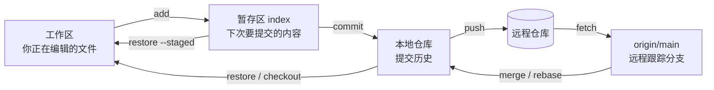

#工程化 #Git #速查

# Git 常用命令速查

## TL;DR

**按「我现在想干什么」查命令，而不是按命令首字母背**。

- 日常 90% 的操作只有六件事：**看状态、暂存、提交、切分支、拉、推**；
- 记不住时先敲 `git status`——它会直接提示当前该用什么命令（包括怎么撤销）；
- 危险命令只有一小撮（`reset --hard`、`push -f`、`clean -fd`、`checkout .`），认准它们，其余基本都能反悔；
- 原理性内容不在本篇：三区与撤销见 [[3.01 Git 核心操作与撤销]]，合并策略见 [[3.02 merge、rebase 与分支工作流]]，远程地址见 [[3.04 Git 远程仓库管理]]。

---

## 1. 命令地图：每条命令作用在哪一层



`git pull` = `fetch` + `merge`；`git clone` = 建仓 + 加 remote + fetch + 检出默认分支。理解这张图，命令是「从哪儿搬到哪儿」的自然结果。

---

## 2. 建仓与克隆

| 命令 | 作用 |
|---|---|
| `git init` | 当前目录变成 Git 仓库 |
| `git clone <地址>` | 克隆远程仓库（自动配好 `origin`） |
| `git clone <地址> <目录名>` | 指定本地目录名 |
| `git clone -b dev <地址>` | 只检出指定分支 |
| `git clone --depth 1 <地址>` | **浅克隆**：只取最近一次提交，CI 里省时间和流量 |
| `git clone --recurse-submodules <地址>` | 连子模块一起拉 |

---

## 3. 看：状态、差异、历史

```bash
git status              # 最重要的一条：改了什么、暂存了什么、还提示下一步命令
git status -s           # 精简格式（M 修改 / A 新增 / ?? 未跟踪）
```

**diff 看的是「哪两层之间的差异」**，这是最容易记错的地方：

| 命令 | 比较对象 |
|---|---|
| `git diff` | 工作区 ↔ 暂存区（**改了但还没 add 的部分**） |
| `git diff --staged` | 暂存区 ↔ 上次提交（**add 了但还没 commit 的部分**） |
| `git diff HEAD` | 工作区 ↔ 上次提交（两部分合起来） |
| `git diff main..dev` | 两个分支之间 |
| `git diff --stat` | 只看每个文件增删了多少行 |

**log 常用组合**：

| 命令 | 用途 |
|---|---|
| `git log --oneline --graph --all` | **一屏看清分支拓扑**，最常用的一条 |
| `git log -5` | 只看最近 5 条 |
| `git log -p <文件>` | 某个文件的历次改动内容 |
| `git log --author="名字"` | 按作者过滤 |
| `git log --since="2 weeks ago"` | 按时间过滤 |
| `git log -S "某段代码"` | **哪次提交引入/删除了这段代码**（查 bug 神器） |
| `git show <commit>` | 看某次提交的完整改动 |
| `git blame <文件>` | 每一行是谁、哪次提交写的 |

---

## 4. 改：暂存与提交

| 命令 | 作用 |
|---|---|
| `git add <文件>` | 暂存指定文件 |
| `git add .` | 暂存当前目录下所有改动 |
| `git add -A` | 暂存整个仓库的所有改动（含删除） |
| `git add -p` | **交互式按代码块暂存**——一个文件里只提交部分改动 |
| `git commit -m "信息"` | 提交暂存区内容 |
| `git commit -am "信息"` | add（**仅已跟踪文件**）+ commit 合成一步 |
| `git commit --amend` | **修改上一条提交**（改信息或补文件），会生成新哈希 |
| `git commit --amend --no-edit` | 把当前暂存内容并进上一条提交，信息不变 |
| `git commit --no-verify` | 跳过钩子（见 [[3.03 Git 钩子与工程规范]]，救急用，别成习惯） |

`--amend` 的红线：**只对还没 push 的提交用**——它改写历史，已推送的再 amend 就得强推。

---

## 5. 分支

| 命令 | 作用 |
|---|---|
| `git branch` | 列出本地分支 |
| `git branch -a` | 连远程跟踪分支一起列 |
| `git branch -vv` | 看每个本地分支跟踪的是哪个远程分支 |
| `git switch <分支>` | 切换分支（新语法，推荐） |
| `git switch -c <新分支>` | 新建并切换 |
| `git switch -` | **切回上一个分支**（像 `cd -`） |
| `git checkout <分支>` | 老语法，等价于 switch（checkout 一词多义，易误伤文件） |
| `git branch -d <分支>` | 删除已合并的分支 |
| `git branch -D <分支>` | 强制删除未合并的分支 |
| `git branch -m <新名>` | 重命名当前分支 |
| `git merge <分支>` | 把目标分支合进当前分支 |
| `git rebase <分支>` | 变基（纪律见 [[3.02 merge、rebase 与分支工作流]]） |

**为什么推荐 switch**：`checkout` 既能切分支又能丢弃文件改动（`git checkout .` 会**无提示清空工作区改动**），Git 2.23 把它拆成了 `switch`（管分支）和 `restore`（管文件），语义清晰、不容易误伤。

---

## 6. 与远程同步

| 命令 | 作用 |
|---|---|
| `git fetch` | **只拉取，不合并**——安全地看看远程有什么新东西 |
| `git fetch --prune` | 顺手清理远程已删除的分支缓存 |
| `git pull` | fetch + merge |
| `git pull --rebase` | fetch + rebase，避免长出无意义的 merge commit |
| `git push` | 推送当前分支（已建立跟踪关系时） |
| `git push -u origin <分支>` | 首次推送并**建立跟踪关系** |
| `git push origin --delete <分支>` | 删除远程分支 |
| `git push --tags` | 推送标签 |
| `git push --force-with-lease` | 强推，但**远程有别人的新提交时会拒绝**——比 `-f` 安全得多 |

远程地址怎么查、怎么改、多 remote 怎么配 → [[3.04 Git 远程仓库管理]]。

---

## 7. 撤销与救急

| 我想…… | 命令 |
|---|---|
| 撤销工作区的修改（还没 add） | `git restore <文件>` |
| 把文件移出暂存区（已 add 没 commit） | `git restore --staged <文件>` |
| 撤销上一条提交但保留改动 | `git reset --soft HEAD~1` |
| 彻底回退到某个提交（**丢弃改动**） | `git reset --hard <commit>` |
| 撤销一个**已推送**的提交 | `git revert <commit>` |
| 临时收起手头改动去切分支 | `git stash` → `git stash pop` |
| 收起改动时连未跟踪文件一起 | `git stash -u` |
| 把别的分支的某个提交摘过来 | `git cherry-pick <commit>` |
| 找回 reset 过头 / 删错分支的提交 | `git reflog` 找到哈希再 `git reset --hard <哈希>` |
| 删掉所有未跟踪的文件和目录 | `git clean -fd`（先用 `git clean -nd` 预览） |

原理与选型（reset 三档、reset vs revert、提交错分支怎么救）见 [[3.01 Git 核心操作与撤销]]。

---

## 8. 标签

```bash
git tag                              # 列出所有标签
git tag -a v1.0.0 -m "首个正式版"     # 打附注标签（推荐，带作者和时间）
git tag -a v1.0.0 <commit>           # 给历史上的某次提交补标签
git push origin v1.0.0               # 标签不会随 git push 自动推送
git tag -d v1.0.0                    # 删本地
git push origin --delete v1.0.0      # 删远程
```

轻量标签（`git tag v1.0.0`）只是一个指针别名；发版用附注标签，它是一个真正的对象，记录了谁在什么时候打的。

---

## 9. 配置与忽略

```bash
git config --global user.name "名字"
git config --global user.email "邮箱"
git config --global init.defaultBranch main    # 新仓库默认分支名
git config --global pull.rebase true           # pull 默认走 rebase
git config --list --show-origin                # 看所有配置及其来源文件
```

配置三级作用域，**就近覆盖**：`--system`（整机）< `--global`（当前用户，`~/.gitconfig`）< 不带参数的仓库级（`.git/config`）。给某个仓库单独设一个提交邮箱，就是在仓库目录里不带 `--global` 执行一次。

**别名**（省敲键）：

```bash
git config --global alias.lg "log --oneline --graph --all"
git config --global alias.st "status -s"
```

**.gitignore 的经典坑**：它只对**未跟踪**的文件生效。已经提交过的文件加进 .gitignore 不会生效，得先让 Git 忘掉它：

```bash
git rm --cached <文件>      # 停止跟踪，但保留本地文件
git rm --cached -r <目录>
```

---

## 10. 排错三件套

| 命令 | 场景 |
|---|---|
| `git log -S "关键代码"` | 这行代码是哪次提交引入的 |
| `git blame -L 10,20 <文件>` | 这几行是谁改的、属于哪次提交 |
| `git bisect start` → `bad` / `good` → `reset` | **二分查找**哪次提交引入了 bug：标记一个坏版本和一个好版本，Git 自动挑中间的提交让你验证，log₂ 次就能定位 |

```bash
git bisect start
git bisect bad                 # 当前版本是坏的
git bisect good v1.0.0         # 这个版本是好的
# Git 自动切到中间提交，测试后回答 git bisect good / bad，反复直到锁定
git bisect reset               # 结束，回到原来的位置
```

---

## 11. 高频组合场景（配方）

| 场景 | 步骤 |
|---|---|
| 刚提交就发现漏了一个文件 | `git add <文件>` → `git commit --amend --no-edit` |
| 提交信息写错了（未推送） | `git commit --amend -m "新信息"` |
| 改动写在了错误的分支上（未提交） | `git stash` → `git switch 正确分支` → `git stash pop` |
| 想看远程有没有更新但不想合并 | `git fetch` → `git log HEAD..origin/main --oneline` |
| 拉取时提示有冲突 | 改文件 → `git add <文件>` → `git commit`（rebase 时用 `git rebase --continue`） |
| 合并合砸了想反悔 | `git merge --abort` / `git rebase --abort` |
| 清理本地已合并的分支 | `git branch --merged main` 确认后逐个 `git branch -d` |
| 只想要别人分支上的某一次提交 | `git cherry-pick <commit>` |
| 临时试个危险操作 | 先 `git branch backup` 留个后路，出事 `git reset --hard backup` |

---

## 12. 危险命令清单

| 命令 | 危险点 | 安全替代 |
|---|---|---|
| `git reset --hard` | **工作区改动直接消失**，未提交的内容无法用 reflog 找回 | 先 `git stash` 或 `git commit` 存一手 |
| `git push -f` | 覆盖远程历史，同事本地全部分叉 | `git push --force-with-lease` |
| `git clean -fd` | 删除未跟踪文件（含未提交的新文件） | 先 `git clean -nd` 预览 |
| `git checkout .` | 无提示丢弃全部工作区改动 | `git restore <指定文件>` |
| `git branch -D` | 强删未合并分支 | 先 `git branch --merged` 确认；删错了用 `reflog` 找回 |

一句心法：**只要提交过，几乎都能靠 `git reflog` 找回来；没提交过的，谁也救不了**。所以危险操作前先提交或 stash，是最便宜的保险。

---

## 相关文章

- [[3.01 Git 核心操作与撤销]] - 三区模型、reset 三档、revert 与撤销选型
- [[3.02 merge、rebase 与分支工作流]] - merge/rebase 的原理与分支工作流选型
- [[3.03 Git 钩子与工程规范]] - pre-commit/commit-msg 钩子、提交信息规范
- [[3.04 Git 远程仓库管理]] - remote 别名、地址查看与修改、远程跟踪分支

---

## 参考资料

- Pro Git（官方中文版）第 2、3、7 章
- `git help <命令>` / `git <命令> -h`：最权威也最快的速查入口
