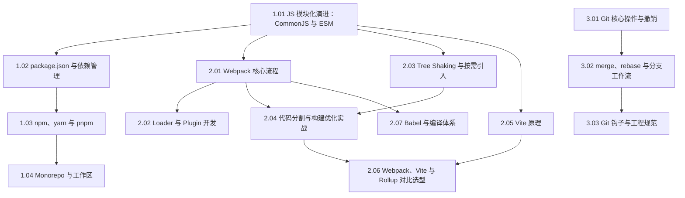

#工程化 #index

# 前端工程化知识地图

> Library/工程化 总索引：阅读顺序、分组清单、概念速查

## 阅读顺序

模块化是一切构建工具的前提，Git 那一支独立，可以随时插入。

---

## 文章清单

### 模块化与包管理

| 文章 | 一句话定位 |
|---|---|
| [[1.01 JS 模块化演进：CommonJS 与 ESM]] | IIFE → AMD/CMD → CommonJS → ESM；静态结构是 Tree Shaking 的前提 |
| [[1.02 package.json 与依赖管理]] | 描述文件 + lock 文件才有可复现安装；依赖三兄弟按「谁用、何时用」分 |
| [[1.03 npm、yarn 与 pnpm]] | node_modules 三代结构演进；pnpm 为什么快、为什么严格 |
| [[1.04 Monorepo 与工作区]] | workspace 是地基，Turborepo/Nx 的拓扑调度与增量缓存是上层 |

### 构建与编译

| 文章 | 一句话定位 |
|---|---|
| [[2.01 Webpack 核心流程]] | 一切皆模块；初始化 → make 构建 → seal/emit 生成三大段 |
| [[2.02 Loader 与 Plugin 开发]] | Loader 管单文件转换（链式从右到左），Plugin 挂 Tapable 钩子管全局 |
| [[2.03 Tree Shaking 与按需引入]] | 三个前提缺一不可：ESM 语法、生产模式、`sideEffects` 契约 |
| [[2.04 代码分割与构建优化实战]] | chunk 的三个来源；构建提速与产物瘦身两条线 |
| [[2.05 Vite 原理]] | 开发不打包 + esbuild 预构建 + 精确 HMR + 生产用 Rollup |
| [[2.06 Webpack、Vite 与 Rollup 对比选型]] | 写应用用 Vite、发库用 Rollup；差异由各自的出身年代决定 |
| [[2.07 Babel 与编译体系]] | parse → transform → generate；语法降级靠插件、API 缺失靠 polyfill |

### Git 与协作规范

| 文章 | 一句话定位 |
|---|---|
| [[3.01 Git 核心操作与撤销]] | 三区流转；未推的用 reset、已推的用 revert |
| [[3.02 merge、rebase 与分支工作流]] | rebase 只用在自己未共享的提交上；工作流按发布节奏选 |
| [[3.03 Git 钩子与工程规范]] | husky 用 `core.hooksPath` 让钩子随仓库分发；lint-staged + commitlint |

---

## 概念速查（这个词在哪篇里讲透了）

| 概念 | 所在笔记 |
|---|---|
| IIFE、AMD/CMD/UMD、CommonJS、ESM、值拷贝 vs 实时绑定 | [[1.01 JS 模块化演进：CommonJS 与 ESM]] |
| dependencies 三兄弟、peerDependencies、lock 文件、exports 字段 | [[1.02 package.json 与依赖管理]] |
| 嵌套与扁平化 node_modules、幽灵依赖、分身问题、硬链接 store | [[1.03 npm、yarn 与 pnpm]] |
| workspace、`workspace:*`、拓扑调度、增量缓存、Changesets | [[1.04 Monorepo 与工作区]] |
| entry、module、chunk、bundle、Compiler 与 Compilation | [[2.01 Webpack 核心流程]] |
| loader 链、pitch、Tapable 钩子、插件生命周期 | [[2.02 Loader 与 Plugin 开发]] |
| usedExports、sideEffects、按需引入、Terser | [[2.03 Tree Shaking 与按需引入]] |
| splitChunks、动态 `import()`、持久化缓存、按需 polyfill | [[2.04 代码分割与构建优化实战]] |
| 依赖预构建、原生 ESM 按需编译、HMR、esbuild | [[2.05 Vite 原理]] |
| IIFE 产物、运行时注入、库打包格式选择 | [[2.06 Webpack、Vite 与 Rollup 对比选型]] |
| AST、preset-env、browserslist、core-js、PostCSS | [[2.07 Babel 与编译体系]] |
| 工作区/暂存区/仓库、reset 三模式、revert、cherry-pick、submodule | [[3.01 Git 核心操作与撤销]] |
| merge commit、rebase 重放、GitHub Flow、GitFlow | [[3.02 merge、rebase 与分支工作流]] |
| pre-commit、commit-msg、husky、lint-staged、commitlint | [[3.03 Git 钩子与工程规范]] |

---

## 跨目录关联

- 把这些工具真正落到项目上的经验 → [[Marauder'sMap/Library/工程实践/Index|前端工程实践知识地图]]
- 包管理器的两篇专题 → [[Marauder'sMap/Library/Node包管理器/Index|Node 包管理器索引]]
- 构建产物的运行时表现 → [[Marauder'sMap/Library/性能优化/Index|性能优化知识地图]]
- 模块系统在 Node 侧的实现 → [[1.02 Node 模块系统与 require 原理]]
- TS 的编译与配置 → [[1.05 模块、配置与工程实践]]

---

## 维护说明

新增工程化笔记时：挂进「模块化与包管理 / 构建与编译 / Git 与协作规范」之一，写一句定位并补概念速查。编号沿用 `1.x / 2.x / 3.x`。原理性内容留本目录，「我在项目里怎么做的」放 Library/工程实践。
