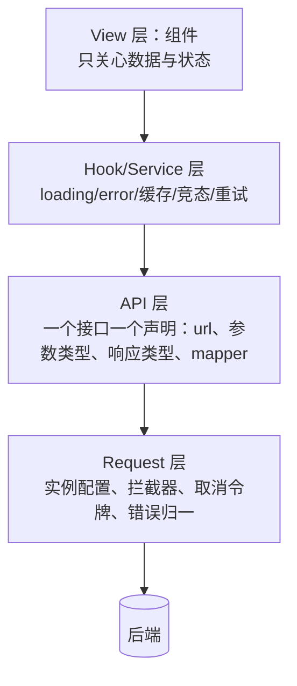

#工程实践 #架构设计 #API #面试

# 前端 API 层架构设计

## TL;DR

**把「请求」拆成四层：Request 层（实例与拦截器）→ API 层（一个接口一个声明式定义）→ Hook/Service 层（状态与生命周期）→ View 层（只消费数据）**。收益是关注点分离：改鉴权只动 Request 层、改接口只动 API 层、改交互只动 View 层；配合 TS 泛型让**后端响应类型一路贯通到组件**。

---

## 1. 问题：请求散落带来的四种病

组件里直接 `axios.get(...)`：URL 硬编码分散各处、鉴权与错误提示每处重写、响应结构转换与业务代码耦合、切换请求库要改全站。规模一大，「加个全局 loading」「统一 401 跳登录」都要改几十处。

---

## 2. 四层结构



**Request 层**——底层实现（axios/fetch 皆可，见 [[1.10 fetch 与 XHR]]）：baseURL、超时、请求拦截注入 token、响应拦截统一剥壳与错误归一、暴露 cancel。可配置开关（如「跳过响应拦截」「静默错误不弹提示」）让特殊接口逃生。

**API 层**——每个接口一份声明式定义，是这套设计的核心：

```ts
// 泛型两参：T = 交给业务的类型，R = 后端原始响应类型（仅用于 mapper 校验）
const getUser = createRequest<User, RawUser>('get', '/user/:id', {
  params: { id },
  mapper: (res) => normalizeUser(res.data),   // ★ 后端结构 → 业务模型的唯一转换点
});
await getUser.send();
getUser.cancel();
```

三个设计点：**URL 模板 + 参数注入**（集中管理路径）；**mapper 隔离后端结构**（后端字段改名只改这一处，业务模型不动）；**取消令牌池**——请求发起时入池、结束时移除，路由切换可批量取消在途请求（防竞态与无效渲染，呼应 [[2.02 useEffect 与 useLayoutEffect]] 的清理）。

**Hook/Service 层**：把「请求」变成「状态」——loading/data/error 三态、竞态处理、缓存与重试（设计范式见 [[2.06 自定义 Hook 实战]] 的 useRequest 插件化）。

**View 层**：只 `const { data, loading } = useUser(id)`，不出现任何 URL 与错误处理细节。

---

## 3. 类型贯通与工程收益

TS 泛型让「后端返回什么 → 组件拿到什么」全程可推导（见 [[1.03 泛型与类型编程]]）：API 层声明的 T 一路传到组件，字段写错编译期就报错。进一步可由 OpenAPI/Swagger **自动生成 API 层代码与类型**——接口契约变更在编译期暴露，这是这套分层的最大红利。

同时要守住边界：**类型注解不等于运行时安全**，后端返回与声明不符时仍会崩——关键接口在 mapper 里做运行时校验（zod 等，见 [[1.05 模块、配置与工程实践]]）。

---

## 面试问答

### Q: 你们的请求层是怎么设计的？

满分答案：四层——Request 层封装实例与拦截器（token 注入、响应剥壳、错误归一、取消令牌），并留「跳过拦截/静默错误」的逃生开关；API 层把每个接口声明为一份定义：URL 模板、参数、响应泛型和 mapper，mapper 是后端结构到业务模型的唯一转换点；Hook 层把请求转成 loading/data/error 状态并处理竞态、缓存、重试；View 层只消费数据。收益是变更局部化——改鉴权只动一层，后端改字段只动 mapper，切换请求库不影响业务。

### Q: 怎么处理请求的竞态和取消？

满分答案：三处配合——Request 层维护取消令牌池，请求发起入池、结束移除，路由切换或页面卸载时批量取消在途请求；Hook 层在依赖变化时先取消上一次请求（或用 cancelled 标记忽略过期响应），保证「后发的请求覆盖先到的旧响应」不会发生；现代实现直接用 AbortController 传 signal。这既避免了脏数据渲染，也避免了卸载后 setState 的警告。

### Q: 前后端接口联调怎么保证类型安全？

满分答案：API 层用泛型声明请求参数与响应类型，让类型从接口定义贯通到组件；进一步用 OpenAPI/Swagger 或后端 schema 自动生成 API 层代码与 TS 类型，接口契约变更在编译期就暴露，而不是等联调或线上报错。同时明确边界：TS 类型编译后擦除、不校验运行时，关键接口要在 mapper 里用 zod 这类库做运行时校验，双保险才叫类型安全。
