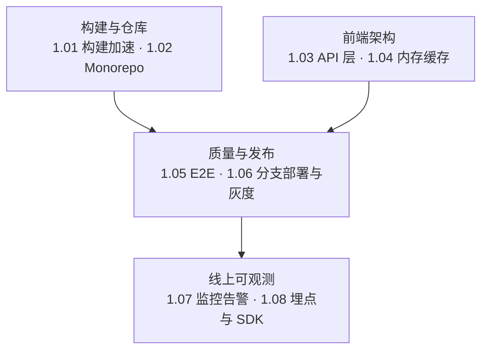

#工程实践 #index

# 前端工程实践知识地图

> Library/工程实践 总索引：分组清单与选读建议
> 本目录是**实战叙事**（背景问题 → 方案选型 → 落地过程 → 效果与反思），原理性内容在 [[Marauder'sMap/Library/工程化/Index|前端工程化知识地图]]

## 怎么读

八篇彼此独立，按你要讲的那个故事挑一篇即可。四条主线：

---

## 文章清单

### 构建与仓库

| 文章 | 一句话定位 |
|---|---|
| [[1.01 前端构建加速实践]] | 按投入产出比三层动手：开缓存 → 换转译器 → 上任务级缓存 |
| [[1.02 Monorepo 落地实践]] | Monorepo 是工程实践的放大器；落地四步与合仓前的前提条件 |

### 前端架构

| 文章 | 一句话定位 |
|---|---|
| [[1.03 前端 API 层架构设计]] | 把请求拆成 Request / API / Hook / View 四层，类型一路贯通到组件 |
| [[1.04 前端内存缓存设计]] | 缓存的值是 Promise 而非数据，天然合并并发；存储位置可替换 |

### 质量与发布

| 文章 | 一句话定位 |
|---|---|
| [[1.05 E2E 测试选型与落地]] | 前端测试更像「奖杯」而非金字塔；没有 E2E 的持续交付是空谈 |
| [[1.06 分支部署与灰度发布]] | 每个 PR 一个可点开的临时地址；灰度按副本数或流量规则放量 |

### 线上可观测

| 文章 | 一句话定位 |
|---|---|
| [[1.07 监控告警与健康检查]] | Metrics / Logging / Tracing 三件套；告警的关键是分级与降噪 |
| [[1.08 前端埋点与 SDK 设计]] | `data-*` 标识一次标记两处复用；SDK 设计四原则 |

---

## 跨目录关联

- 构建工具本身的原理 → [[2.04 代码分割与构建优化实战]]、[[2.05 Vite 原理]]
- Monorepo 的工具层地基 → [[1.04 Monorepo 与工作区]]
- 缓存设计里的请求合并与 Promise 语义 → [[2.02 Promise 用法与手写实现]]
- 性能指标与监控 SDK 的采集面 → [[2.01 Web 性能指标与前端监控]]
- 错误上报工具 → [[Marauder'sMap/Library/Infrastructure/Index|基础设施知识地图]]（Sentry 系列）
- 部署与容器化 → [[1.06 Node 部署与 Docker]]

---

## 维护说明

本目录的文章一律**脱敏**：不写公司名、内部系统名、项目代号、内部域名与仓库地址，统一改写为「公司 xx 项目」「内部发布平台」这类通用表述。新增时挂进上面四组之一并写一句定位，编号沿用 `1.x`。
