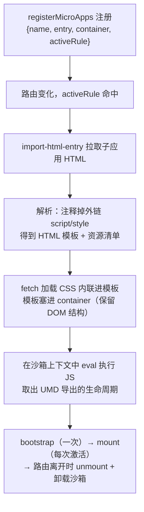

#微前端 #qiankun #原理 #面试

# qiankun 核心原理

## TL;DR

**qiankun = single-spa（路由驱动的应用生命周期调度）+ HTML entry（import-html-entry 解析子应用 HTML 拿资源）+ 沙箱（JS/CSS 隔离）**。子应用无需大改：导出 bootstrap/mount/unmount 三个生命周期、打包成 UMD、允许跨域即可被主应用接管。

---

## 1. 整体流程



**HTML entry 的价值**（对比 JS entry）：子应用把自己的 index.html 当「资源清单 + DOM 骨架」交出来——主应用连它的 HTML 结构一起渲染（包一层 div 放进容器），子应用几乎不用改造；资源路径、分包、hash 更新都由子应用自己的构建管理。

---

## 2. 子应用改造的三件事（原理各有出处）

```js
// ① 导出生命周期（qiankun 靠它接管）
export async function bootstrap() {}
export async function mount(props) { render(props.container); }
export async function unmount() { app.unmount(); }

// ② webpack 打包配置：UMD 让主应用 eval 后能拿到导出
output: {
  library: `${name}-[name]`,
  libraryTarget: 'umd',
  // webpack4 还要 jsonpFunction: `webpackJsonp_${name}`
  //（webpack5 改为 chunkLoadingGlobal）
  // ★ 隔离各应用的 chunk 注册全局函数——否则两个 webpack 应用的
  //    动态 import（JSONP 机制，见工程化 2.04）互相覆盖回调，chunk 装错家
}

// ③ 动态 publicPath：子应用资源相对自己域名加载
__webpack_public_path__ = window.__INJECTED_PUBLIC_PATH_BY_QIANKUN__;
```

**动态 import 为什么要特殊处理**：webpack 的异步 chunk 靠全局 JSONP 回调注册（`webpackJsonp.push`），多个子应用同名就会串台——所以每个应用的 jsonpFunction/chunkLoadingGlobal 必须唯一；这题实际考 [[2.04 代码分割与构建优化实战]] 里 JSONP 加载机制的理解。

---

## 3. 运行时机制点名

- **劫持**：执行子应用 JS 时以 `with(sandbox) + eval` 的方式把 window 替换为沙箱代理（机制详见 [[1.03 JS 沙箱机制]]）；同时劫持 setTimeout/addEventListener/动态 appendChild 等，unmount 时统一清理副作用；
- **预加载 prefetch**：监听 single-spa 的 first-mount 事件后开始——**弱网/离线不预载**（navigator.onLine 与网络类型判断），requestIdleCallback 空闲时用 import-html-entry 把其他子应用的 HTML/JS/CSS 拉进缓存（思路同 [[2.04 script 加载与资源提示]] 的 prefetch）；
- **应用间跳转**：本质就是 `history.pushState`——activeRule 基于路由，改 URL 即触发对应应用的挂载/卸载；封装层面主应用提供统一的导航方法或用 microApp 名称路由表；
- **通信**：官方 initGlobalState（发布订阅）+ props 注入（见 [[1.05 应用间通信与落地实践]]）。

---

## 面试问答

### Q: qiankun 的加载流程？HTML entry 是什么？

满分答案：注册时给出 entry 与 activeRule，路由命中后用 import-html-entry 拉取子应用 HTML，解析出模板与外链资源清单——CSS 拉回内联、HTML 骨架放进主应用容器，JS 在沙箱上下文里执行并取 UMD 导出的 bootstrap/mount/unmount，交给 single-spa 按路由调度。HTML entry 的好处：子应用以自己的 index.html 为资源清单，几乎零改造，资源版本与分包由子应用构建自治；对比 JS entry 需要子应用把一切打进单个 bundle。

### Q: 子应用要做哪些改造？为什么要配 UMD 和 jsonpFunction？

满分答案：三件事——导出三个生命周期供接管；打包 libraryTarget: umd，主应用执行完脚本才能从模块导出里拿到生命周期；设置唯一的 jsonpFunction（webpack5 是 chunkLoadingGlobal）并注入动态 publicPath。后两者的原理：动态 import 的 chunk 靠全局 JSONP 回调数组注册，多应用共存时同名回调会互相覆盖导致 chunk 装载串台；publicPath 动态化让子应用的异步资源仍从自己的域名加载。

### Q: qiankun 的预加载怎么实现的？

满分答案：首个应用挂载完成（single-spa:first-mount 事件）后启动：先判网络——离线或弱网直接放弃；然后在 requestIdleCallback 空闲时段用 import-html-entry 预拉其余子应用的 HTML 并顺藤摸瓜 fetch 其 JS/CSS 进 HTTP 缓存，真正切换时秒开。设计上是「浏览器空闲 + 网络分级」的资源预热，与 link prefetch 思路一致但可编程性更强。
