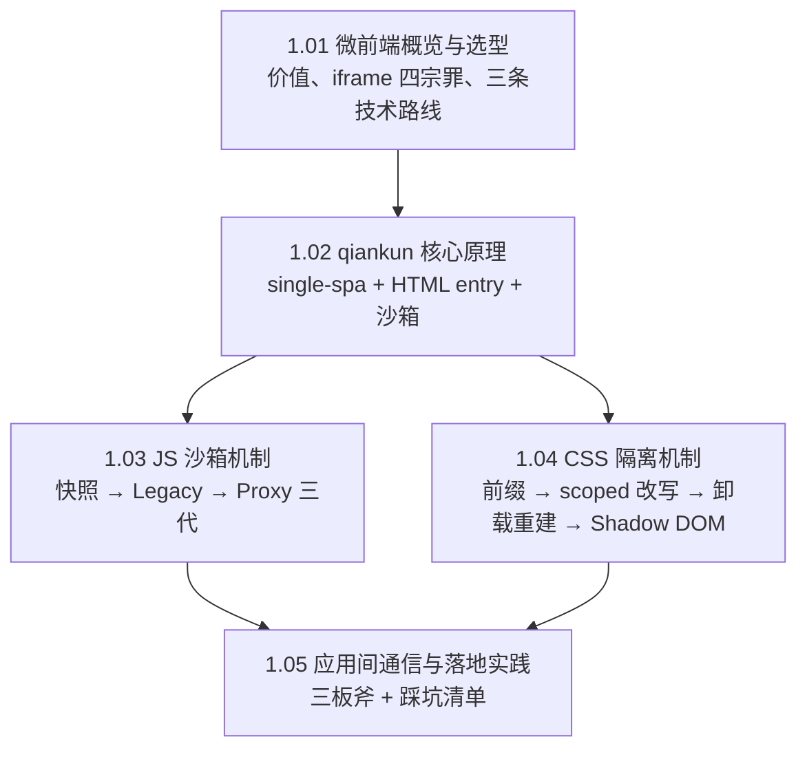

#微前端 #index

# 微前端知识地图

> Library/微前端 总索引：阅读顺序、分组清单、概念速查

## 阅读顺序

顺着「为什么要做 → 谁来做 → 怎么隔离 → 怎么协作」读一遍即可。

---

## 文章清单

| 文章 | 一句话定位 |
|---|---|
| [[1.01 微前端概览与选型]] | 核心价值是技术栈无关；iframe 四宗罪推出 qiankun / wujie / Module Federation 三条路线 |
| [[1.02 qiankun 核心原理]] | single-spa 调度 + import-html-entry 解析 + 沙箱；子应用只需导出三个生命周期 |
| [[1.03 JS 沙箱机制]] | 「改了全局要还得回来」的三代解法，Proxy 沙箱支持多实例 |
| [[1.04 CSS 隔离机制]] | 四类方案按隔离强度排，各自的代价与适用场景 |
| [[1.05 应用间通信与落地实践]] | props / initGlobalState / 自建总线；踩坑清单每条都能反推一条原理 |

---

## 概念速查（这个词在哪篇里讲透了）

| 概念 | 所在笔记 |
|---|---|
| 技术栈无关、独立部署、iframe 四宗罪、Module Federation、wujie | [[1.01 微前端概览与选型]] |
| single-spa、HTML entry、bootstrap/mount/unmount、UMD 打包 | [[1.02 qiankun 核心原理]] |
| 快照沙箱、Legacy 沙箱、Proxy 沙箱、fakeWindow、多实例 | [[1.03 JS 沙箱机制]] |
| BEM 前缀、CSS Modules、scoped 改写、样式卸载重建、Shadow DOM | [[1.04 CSS 隔离机制]] |
| initGlobalState、事件总线、共享 store、publicPath、路由 base | [[1.05 应用间通信与落地实践]] |

---

## 跨目录关联

- 沙箱依赖的语言机制 → [[1.08 Proxy 与 Reflect]]
- 样式隔离的 CSS 侧背景 → [[1.09 CSS 工程化：模块化方案、iconfont 与字体]]、[[1.04 CSS 隔离机制]]
- Module Federation 所属的构建层 → [[2.01 Webpack 核心流程]]、[[2.04 代码分割与构建优化实战]]
- 跨域头、资源加载相关的坑 → [[1.06 同源策略与跨域]]

---

## 维护说明

新增微前端笔记时：挂进文章清单并写一句定位，编号沿用 `1.x`。工具选型与原理留本目录，公司落地叙事放 Library/工程实践。
