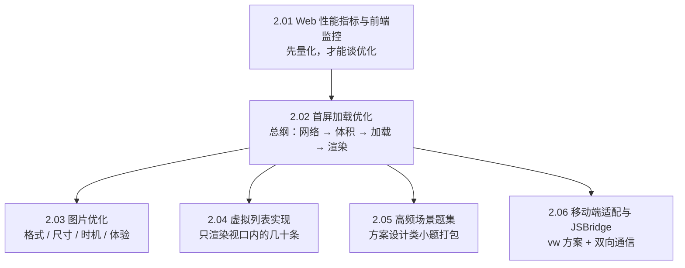

#性能优化 #index

# 性能优化知识地图

> Library/性能优化 总索引：阅读顺序、分组清单、概念速查

## 阅读顺序

先能量化（指标），再谈优化；[[2.02 首屏加载优化]] 是本目录的总纲，其余各篇是它某一环的展开。

---

## 文章清单

| 文章 | 一句话定位 |
|---|---|
| [[2.01 Web 性能指标与前端监控]] | Core Web Vitals 三大件（LCP / INP / CLS）+ 监控 SDK 的三大板块 |
| [[2.02 首屏加载优化]] | 按请求流水线逐环节优化，别背散点；本篇是汇总索引与答题框架 |
| [[2.03 图片优化]] | 四路并进：格式、尺寸、时机、体验；手写懒加载是必备题 |
| [[2.04 虚拟列表实现]] | 定高版三个数就够；不定高版靠预估 → 实测修正 → 二分查找 |
| [[2.05 高频场景题集]] | 大数组查找、上线通知刷新、通用 SDK、低代码、SSE，考的是权衡叙述 |
| [[2.06 移动端适配与 JSBridge]] | rem → vw 的适配演进；JSBridge 双向通信都是发布订阅 + callbackId |

---

## 概念速查（这个词在哪篇里讲透了）

| 概念 | 所在笔记 |
|---|---|
| LCP、INP（替代 FID）、CLS、FCP、TTFB、`PerformanceObserver`、错误捕获 | [[2.01 Web 性能指标与前端监控]] |
| 关键 CSS 内联、路由懒加载、骨架屏、SSR/SSG、按需 polyfill | [[2.02 首屏加载优化]] |
| WebP / AVIF、`<picture>`、srcset、`loading="lazy"`、IntersectionObserver、CLS 占位 | [[2.03 图片优化]] |
| 可视区计算、translateY 摆位、预估高度、二分查找 | [[2.04 虚拟列表实现]] |
| 版本指纹轮询、插件化 useRequest、低代码 schema、SSE 流式渲染 | [[2.05 高频场景题集]] |
| flexible / rem、vw + postcss、注入 API、`evaluateJavascript`、callbackId | [[2.06 移动端适配与 JSBridge]] |

---

## 跨目录关联

- 渲染流水线与回流重绘（优化的底层依据）→ [[2.03 浏览器渲染原理与回流重绘]]
- 资源加载与预取 → [[2.04 script 加载与资源提示]]
- 缓存与 CDN → [[1.04 HTTP 缓存策略]]、[[1.05 DNS 与 CDN]]
- 产物体积治理 → [[2.03 Tree Shaking 与按需引入]]、[[2.04 代码分割与构建优化实战]]
- 只动 transform 和 opacity 的动画铁律 → [[1.08 CSS 动画与渲染性能]]
- 框架侧的渲染优化 → [[3.02 React 性能优化清单]]
- 线上监控的落地叙事 → [[1.07 监控告警与健康检查]]、[[1.08 前端埋点与 SDK 设计]]

---

## 维护说明

新增性能笔记时：挂进文章清单并写一句定位，编号沿用 `2.x`，同时到 [[2.02 首屏加载优化]] 对应环节补一条下钻链接——那篇是总纲，不更新它索引就会断。
