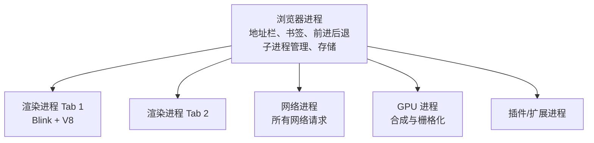

#浏览器 #进程 #线程 #面试

# 浏览器进程、线程与事件循环

## TL;DR

**Chrome 是多进程架构：浏览器进程管壳，每个标签页默认一个渲染进程，另有网络、GPU、插件进程**。渲染进程里干活的是「渲染主线程」——解析 HTML/CSS、布局绘制、执行 JS 全在这一条线程上，这就是「JS 阻塞渲染」的根源，也是事件循环存在的理由。

---

## 1. 进程与线程的关系

进程是操作系统**分配资源**的单位（独立内存空间，崩了不连累别人）；线程是 **CPU 调度**的单位，依附于进程、共享其内存。进程间通信要走 IPC。

浏览器选多进程的理由：**隔离**——一个标签页崩溃/被攻击，不影响其他页和浏览器本体（沙箱安全也建立在进程边界上）。

---

## 2. Chrome 的进程分工

要点：默认**每个标签页一个渲染进程**（同站点标签可能合并）；渲染进程运行 Blink 排版引擎和 V8，被沙箱包裹——它自己不能直接发网络请求、读文件，都要委托浏览器进程/网络进程（这就是「输入 URL 后网络请求不在渲染进程发」的原因，见 [[2.02 从输入 URL 到页面展示]]）。

---

## 3. 渲染进程里的线程

| 线程 | 职责 |
|---|---|
| **渲染主线程**（最忙） | 解析 HTML/CSS、样式计算、布局、执行 JS、事件回调、定时器回调 |
| 合成线程 | 把分好层的页面栅格化、合成，**不经主线程**（transform 动画流畅的原因） |
| 定时器线程 | 计时（JS 单线程忙时还能准时计时），到点把回调排进队列 |
| 网络异步线程 | XHR/fetch 由网络进程完成后，回调排进队列 |
| 事件触发线程 | 管理事件循环的任务入队 |

**为什么 JS 执行和渲染互斥**：都跑在渲染主线程上。JS 能改 DOM，若解析/渲染与 JS 并行，就会产生数据竞争，所以设计成单线程串行——JS 长任务一跑，页面就不刷新、点不动。规避手段见 [[2.04 并发控制与耗时任务优化]]（时间切片/Worker）。

---

## 4. 事件循环：单线程的调度器

主线程从任务队列取任务执行的循环。完整规则（宏任务/微任务/渲染时机、输出题解法）已在 [[2.01 事件循环与宏微任务]] 详述，这里补浏览器架构视角：

- 「异步」的本质是**别的线程/进程代劳**：定时器线程计时、网络进程发请求，完成后把回调**排队**，主线程有空才执行——所以 setTimeout 的延时是下限不是精确值；
- 队列不止一个：Chrome 里输入事件等交互任务有更高优先级的队列，保证点击不被普通任务饿死；
- 一帧的工作（rAF → 样式 → 布局 → 绘制 → 合成）穿插在任务之间，见 [[2.03 浏览器渲染原理与回流重绘]]。

---

## 面试问答

### Q: 浏览器有哪些进程？为什么是多进程架构？

满分答案：浏览器进程（界面与子进程管理）、每标签页一个的渲染进程（Blink + V8，负责页面）、网络进程（统一收发请求）、GPU 进程（合成栅格化）、插件进程。多进程为了隔离与安全：单页崩溃不拖垮浏览器，渲染进程被沙箱限制、文件和网络能力都委托给特权进程，恶意页面难以越权。代价是内存占用更高。

### Q: 渲染进程里有哪些线程？为什么 JS 是单线程的？

满分答案：渲染主线程（解析、样式、布局、绘制指令、执行 JS 与各种回调）、合成线程、定时器线程、网络回调线程、事件触发线程。JS 单线程是因为它与渲染共用主线程且能修改 DOM——并行会产生数据竞争，设计上用「单线程 + 事件循环 + 其他线程代劳异步」换取一致性。推论：JS 长任务阻塞渲染，重计算要切片或放 Worker。

### Q: 为什么 transform 动画比改 left/top 流畅？

满分答案：transform/opacity 动画可以把元素提升为独立合成层，动画由合成线程（配合 GPU）直接处理，不需要主线程参与布局和绘制；而 left/top 每帧都触发主线程的回流重绘，一旦主线程被 JS 占住动画就掉帧。这也是「主线程忙时 CSS transform 动画照样跑」的原理。

### Q: setTimeout 为什么不准？

满分答案：从架构讲——计时由独立的定时器线程完成，到点只是把回调放进任务队列，真正执行要等主线程空闲，前面有长任务就延迟；HTML 规范还规定嵌套 5 层以上定时器最小间隔 4ms、后台标签页会被节流到秒级甚至分钟级。所以它保证「不早于」，不保证准点，对时敏感场景用时间戳校准（见 [[2.04 并发控制与耗时任务优化]]的倒计时方案）。
