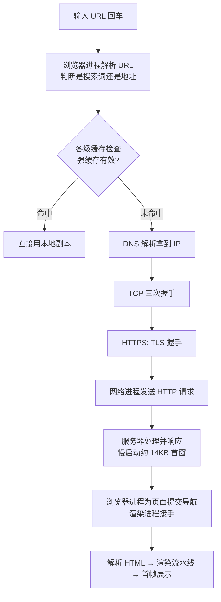

#浏览器 #网络 #渲染 #面试

# 从输入 URL 到页面展示

## TL;DR

**这道「串珠题」的珠子：URL 解析 → 缓存检查 → DNS 解析 → TCP 握手 → TLS 协商 → 发请求 → 服务器响应 → 浏览器解析渲染 → 交互就绪**。答题策略是先报全流程骨架，再在面试官追问的环节下钻——每一环都对应一篇专题文章。

---

## 1. 全流程图

进程视角（加分项）：输入解析在**浏览器进程**，请求收发在**网络进程**，收到 HTML 响应头确认导航后，浏览器进程通知**渲染进程**「提交导航」，渲染进程边接收字节流边解析——多进程协作正是 [[2.01 浏览器进程、线程与事件循环]] 的内容落地。

---

## 2. 逐环节要点（+ 下钻入口）

1. **URL 解析**：判断搜索词还是 URL、补全协议；检查 HSTS 列表决定是否强制 HTTPS。
2. **缓存检查**：Memory Cache → Service Worker → HTTP 强缓存，命中则跳过网络 → [[1.04 HTTP 缓存策略]]。
3. **DNS**：浏览器/系统/本地 DNS 逐层缓存，未命中走递归+迭代查询 → [[1.05 DNS 与 CDN]]；接了 CDN 就在这一步被调度到边缘节点。
4. **TCP 三次握手** → [[1.01 网络分层模型与 TCP 连接]]。
5. **TLS 握手**（1.3 是 1-RTT）→ [[1.03 HTTPS 与 TLS 握手]]。若是 HTTP/3/QUIC，传输与加密握手合并。
6. **请求/响应**：带上 Cookie 和缓存校验头；服务器可能 304；响应受 TCP 慢启动约束——**首个拥塞窗口约 14KB**，关键 CSS 内联到 14KB 内可省一个往返（性能优化的出处）。
7. **解析渲染**：HTML → DOM，CSS → CSSOM，合成渲染树、布局、绘制 → [[2.03 浏览器渲染原理与回流重绘]]；遇到 script 的阻塞行为 → [[2.04 script 加载与资源提示]]。
8. **交互就绪**：DOMContentLoaded（DOM 树完成）→ 资源全载 load。

---

## 3. 两个衍生小题

**window.location.href 跳转后，后面的代码还执行吗？**

执行。赋值 `location.href` 只是**发起导航**，导航是异步的——当前脚本的同步代码会继续跑完；已排队的微任务通常也会执行，但 setTimeout 等宏任务大概率随页面卸载而作废。所以「跳转后不想再执行」要自己 `return`。同理：`beforeunload` 里还能拦截。

**刷新与重复访问为什么快？**

三层加速叠加：HTTP 缓存（大概率 304 或直接强缓存）、连接复用（Keep-Alive/HTTP2 连接还活着，免握手）、bfcache（前进后退缓存，整页快照级恢复）。

---

## 4. 性能视角复盘（把流程题升华）

每一环对应一个优化抓手：

| 环节 | 优化 |
|---|---|
| DNS | dns-prefetch、减少域名数 |
| 连接 | preconnect、HTTP/2 多路复用、升级 HTTP/3 |
| 响应 | CDN、压缩（br）、关键内容进首个 14KB |
| 解析 | 关键 CSS 内联、script defer、preload 关键资源 |
| 渲染 | 减少回流、图片定尺寸防布局偏移 |

面试官问「怎么优化白屏」时，按这条流水线逐环节给方案就是满分结构。

---

## 面试问答

### Q: 从输入 URL 到页面显示经历了什么？

满分答案：报骨架——浏览器进程解析 URL 并查 HSTS；逐级缓存检查，强缓存命中直接用；DNS 解析（浏览器/系统/本地 DNS 缓存 → 递归迭代查询，CDN 在此调度）；TCP 三次握手、TLS 协商；网络进程发请求、服务器响应（慢启动首窗约 14KB）；浏览器进程提交导航给渲染进程，解析 HTML 构建 DOM/CSSOM、布局绘制合成出首帧；DOMContentLoaded、load 相继触发。然后声明「每个环节都可以展开」，把主动权交给面试官。

### Q: 这个过程涉及哪些进程的协作？

满分答案：浏览器进程负责 URL 解析、导航管理和最终的「提交导航」；网络进程负责 DNS、建连和请求收发；渲染进程收到 HTML 数据流后解析渲染，页面内后续的 fetch 也要委托网络进程（渲染进程被沙箱隔离无网络能力）；GPU 进程参与最后的合成上屏。单页崩溃不影响其他标签的原因就在这个进程边界。

### Q: location.href 赋值跳转后，后面的 JS 还会执行吗？

满分答案：会。赋值只是发起异步导航，当前同步代码继续执行完毕，微任务一般也会跑；真正终止发生在新文档开始替换旧文档时，未执行的宏任务作废。想跳转即止需要显式 return。这题考「导航是异步的」这一认知。

### Q: 首屏白屏时间怎么优化？

满分答案：按请求流水线逐环节给——DNS 层 dns-prefetch/收敛域名；连接层 preconnect、HTTP/2/3；传输层 CDN、Brotli 压缩、关键 CSS 内联进首个 14KB；解析层 script defer/async 不阻塞、preload 关键字体和 LCP 图片；渲染层减少首屏回流、骨架屏兜底感知。回答体现「知道每毫秒花在哪」比罗列技巧更重要。
