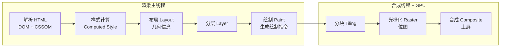

#浏览器 #渲染 #回流重绘 #面试

# 浏览器渲染原理与回流重绘

## TL;DR

**渲染是八段流水线：解析 HTML → 样式计算 → 布局 → 分层 → 绘制 → 分块 → 光栅化 → 合成上屏**，前五段在渲染主线程，后三段交给合成线程和 GPU。**回流动了几何（从布局起重跑），重绘只动外观（跳过布局），transform/opacity 只动合成（两段都跳）**——性能优化的分水岭全在这。

---

## 1. 渲染流水线

各段要点：

- **解析 HTML**：边下边解析；**预解析线程**提前扫描并下载外部 CSS/JS；
- **样式计算**：每个节点算出 Computed Style（`red`→`rgb(255,0,0)`、`em`→`px`）；
- **布局**：算几何。布局树 ≠ DOM 树——`display:none` 不进布局树，伪元素虽不在 DOM 却在布局树；
- **分层**：滚动条、堆叠上下文、transform、opacity、will-change 影响分层；某层变化只重处理该层；
- **绘制**：主线程只生成**绘制指令列表**，真正画图（光栅化）在合成线程/GPU 进程；
- **合成**：滚动、transform 动画在这层直接完成，**不回主线程**。

---

## 2. 三种阻塞关系（背下来）

| 关系 | 结论 | 原因 |
|---|---|---|
| CSS ↔ DOM 解析 | **不阻塞解析** | CSS 下载解析在预解析线程 |
| CSS ↔ 渲染 | **阻塞渲染** | 没有 CSSOM 就不能算样式，防止「裸奔闪烁」 |
| JS ↔ DOM 解析 | **阻塞解析** | JS 可能改 DOM，解析必须暂停等它执行 |
| CSS ↔ JS | **CSS 阻塞 JS 执行** | JS 可能读样式（getComputedStyle），须等 CSSOM 就绪 |

连锁推论：CSS 本不阻塞 DOM 解析，但「CSS 阻塞 JS、JS 阻塞解析」——**CSS 会间接阻塞 DOM 解析**。这就是「CSS 放头部、JS 放尾部或加 defer」的完整论证（script 加载策略见 [[2.04 script 加载与资源提示]]）。

---

## 3. 回流（重排）与重绘

- **回流 Reflow**：几何信息变了（宽高、位置、字体大小、增删节点、改窗口大小），从**布局**阶段重跑——必然带着重绘和合成，代价最大；
- **重绘 Repaint**：只改外观（颜色、背景、visibility），跳过布局从**绘制**起重跑；
- **仅合成**：transform、opacity 提升为独立层后，动画由合成线程处理，**布局绘制全跳过**——最便宜。

**浏览器的批处理优化与「强制同步布局」**：浏览器会把多次样式修改攒起来批量回流；但你一旦**读取布局信息**（offsetTop/Width、scrollTop、clientHeight、getComputedStyle、getBoundingClientRect），队列被迫立刻清空以给你精确值——「写读写读」交替就成了逐次回流。对策：**读写分离**（先集中读、再集中写），值缓存复用。

减少回流清单：批量改类名而非逐条改 style；文档流外操作（display:none 后改完再显示、DocumentFragment）；动画元素绝对定位脱离文档流；用 transform/opacity 做动画；图片写死宽高防加载后二次回流（也是 CLS 优化）。

**合成层（GPU 加速）**：`transform: translateZ(0)`、`will-change: transform`、video/canvas/iframe 会提升为合成层。注意副作用——每层都占内存，滥用会「层爆炸」；will-change 用完要移除。

---

## 4. 一帧之内发生什么（进阶）

60Hz 下一帧约 16.7ms，顺序：**输入事件（阻塞类 touch/wheel 优先）→ 宏任务 → 微任务清空 → 判断是否需要渲染 →（若渲染）resize/scroll 回调 → rAF 回调 → 样式计算与布局 → 绘制合成 → 剩余时间跑 requestIdleCallback**。

两个推论：不是每轮事件循环都渲染（多个宏任务可能共享一次渲染）；rAF 在布局绘制**前**执行所以适合改样式，idle 回调只在有剩余时间时执行所以只放低优任务（呼应 [[2.04 并发控制与耗时任务优化]]）。

---

## 面试问答

### Q: 浏览器是怎么渲染页面的？

满分答案：按流水线讲——解析 HTML 得到 DOM 和 CSSOM（预解析线程提前下载外部资源）；样式计算得出每个节点的 Computed Style；布局计算几何信息生成布局树（与 DOM 树不一一对应：display:none 不进、伪元素进）；分层；绘制生成指令列表；之后交给合成线程分块、光栅化，最终 GPU 合成上屏。加分点：主线程只到「生成绘制指令」，画图是合成线程和 GPU 的事，所以滚动和 transform 动画不受主线程卡顿影响。

### Q: 回流和重绘的区别？怎么减少回流？

满分答案：回流是几何变化从布局阶段重跑、必然引发重绘，代价最大；重绘只改外观从绘制起跑；transform/opacity 走合成层两者都跳过。减少回流：读写分离避免强制同步布局（offsetTop 等读取会清空浏览器的批处理队列）、批量改 class、DocumentFragment/display:none 离线操作、动画用 transform 并让元素脱离文档流、图片预设尺寸。定位工具：Performance 面板看紫色 Layout 是否密集。

### Q: 为什么 JS 要放底部、CSS 放头部？

满分答案：JS 会阻塞 DOM 解析（可能改 DOM），放底部保证解析不被打断；CSS 不阻塞解析但阻塞渲染，且会阻塞后续 JS 执行（JS 可能读样式）——放头部让 CSSOM 尽早就绪，避免无样式闪烁和对 JS 的间接阻塞。现代等价做法：script 加 defer/async、关键 CSS 内联、非关键 CSS 异步加载。

### Q: GPU 加速（合成层）是什么？有什么代价？

满分答案：某些属性（transform、opacity、will-change、video/canvas）会让元素提升为独立合成层，其动画由合成线程 + GPU 直接处理，跳过主线程的布局与绘制，因此不受 JS 长任务影响。代价：每个层要占显存，层过多导致内存暴涨（层爆炸）；GPU 渲染文本抗锯齿差异可能导致字体模糊，动画结束应移除 will-change。原则：只给真正做动画的元素开。
