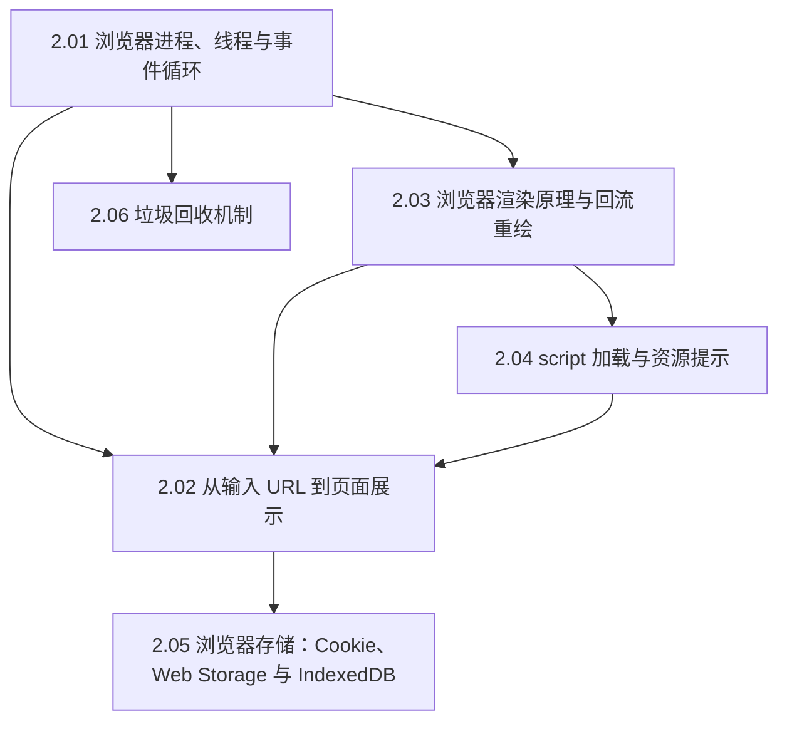

#浏览器 #index

# 浏览器知识地图

> Library/浏览器 总索引：阅读顺序、分组清单、概念速查

## 阅读顺序

先看进程线程（谁在干活），再看渲染流水线（怎么干），最后是存储与内存。

[[2.02 从输入 URL 到页面展示]] 是本目录的「串珠题」：先报全流程骨架，再按追问下钻到其他篇。

---

## 文章清单

| 文章 | 一句话定位 |
|---|---|
| [[2.01 浏览器进程、线程与事件循环]] | 多进程架构 + 渲染主线程；「JS 阻塞渲染」的根源与事件循环存在的理由 |
| [[2.02 从输入 URL 到页面展示]] | 串珠题：URL 解析 → 缓存 → DNS → TCP → TLS → 请求 → 解析渲染 → 交互就绪 |
| [[2.03 浏览器渲染原理与回流重绘]] | 八段流水线；回流从布局起重跑、重绘跳过布局、合成两段都跳 |
| [[2.04 script 加载与资源提示]] | defer 与 async 的差别；preload/prefetch/preconnect/dns-prefetch 按确定性排 |
| [[2.05 浏览器存储：Cookie、Web Storage 与 IndexedDB]] | 给服务器捎话的 / 存前端自己的 / 浏览器里的数据库 |
| [[2.06 垃圾回收机制]] | 可达性分析 + 标记清除；V8 分代回收与把停顿藏起来的三板斧 |

---

## 概念速查（这个词在哪篇里讲透了）

| 概念 | 所在笔记 |
|---|---|
| 浏览器进程 / 渲染进程 / GPU 进程、渲染主线程、IPC | [[2.01 浏览器进程、线程与事件循环]] |
| 关键渲染路径、交互就绪、全流程下钻 | [[2.02 从输入 URL 到页面展示]] |
| DOM 树、CSSOM、布局、分层、绘制、光栅化、合成、回流与重绘 | [[2.03 浏览器渲染原理与回流重绘]] |
| defer、async、preload、prefetch、preconnect、DOMContentLoaded | [[2.04 script 加载与资源提示]] |
| Cookie 属性（Domain/Path/HttpOnly/Secure/SameSite）、localStorage、sessionStorage、IndexedDB | [[2.05 浏览器存储：Cookie、Web Storage 与 IndexedDB]] |
| 可达性、标记清除、标记整理、Scavenge、新生代/老生代、增量与并发回收、内存泄漏 | [[2.06 垃圾回收机制]] |

---

## 跨目录关联

- 事件循环的语言侧（宏微任务顺序题）→ [[2.01 事件循环与宏微任务]]
- 引擎如何执行 JS → [[V8 引擎与 JIT 编译]]、[[JS执行模型]]
- 网络那一半 → [[Marauder'sMap/Library/HTTP/Index|网络与 HTTP 知识地图]]
- 渲染性能怎么优化 → [[2.03 图片优化]]、[[1.08 CSS 动画与渲染性能]]、[[Marauder'sMap/Library/性能优化/Index|性能优化知识地图]]
- Node 侧的内存泄漏排查 → [[1.05 Node 内存泄漏排查]]

---

## 维护说明

新增浏览器笔记时：挂进文章清单并写一句定位，编号沿用 `2.x`。协议与网络层内容放 Library/HTTP，优化手段与指标放 Library/性能优化，本目录只放「浏览器怎么实现的」。
